# Brukerveiledning

Lenke til nettside: https://fagprove.fithappens.ai/

Bergen Kulturguide består av to deler: en **offentlig nettside** som er åpen for alle besøkende, og et **admin-panel** som krever innlogging og brukes til å administrere innholdet. Denne veiledningen dekker begge deler.

## Innhold

- [Offentlig nettside](#offentlig-nettside)
  - [Landingsside](#landingsside)
  - [Arrangementer (oversikt, søk og filtrering)](#arrangementer)
  - [Favoritter](#favoritter)
  - [Detaljside for et arrangement](#detaljside-for-et-arrangement)
  - [Kontaktside](#kontaktside)
  - [Lys og mørk modus](#lys-og-mørk-modus)
- [Admin-panel](#admin-panel)
  - [Innlogging](#innlogging)
  - [Registrering](#registrering)
  - [Glemt passord](#glemt-passord)
  - [Dashboard](#dashboard)
  - [Arrangementer (admin)](#arrangementer-admin)
  - [Arrangementskategorier](#arrangementskategorier)
  - [Kontakthenvendelser](#kontakthenvendelser)
  - [Logg ut](#logg-ut)

---

# Offentlig nettside

Den offentlige nettsiden er åpen for alle og krever ingen innlogging. Øverst på siden ligger en meny (header/navbar) med logo, en lenke til **Kontakt** og en knapp til **Arrangementer**. Nederst på siden ligger en footer med lenke til admin-panelet, kontakt og en knapp for å bytte mellom lys og mørk modus.

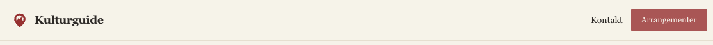

## Landingsside

Landingssiden ønsker den besøkende velkommen med en kort introduksjon til Bergen Kulturguide og en "Se arrangementer"-knapp som tar deg videre til oversikten. Under introduksjonen vises et utvalg av **utvalgte arrangementer** (arrangementer som en administrator har markert som "featured"), sortert slik at kommende arrangementer som ligger nærmest i tid vises først.

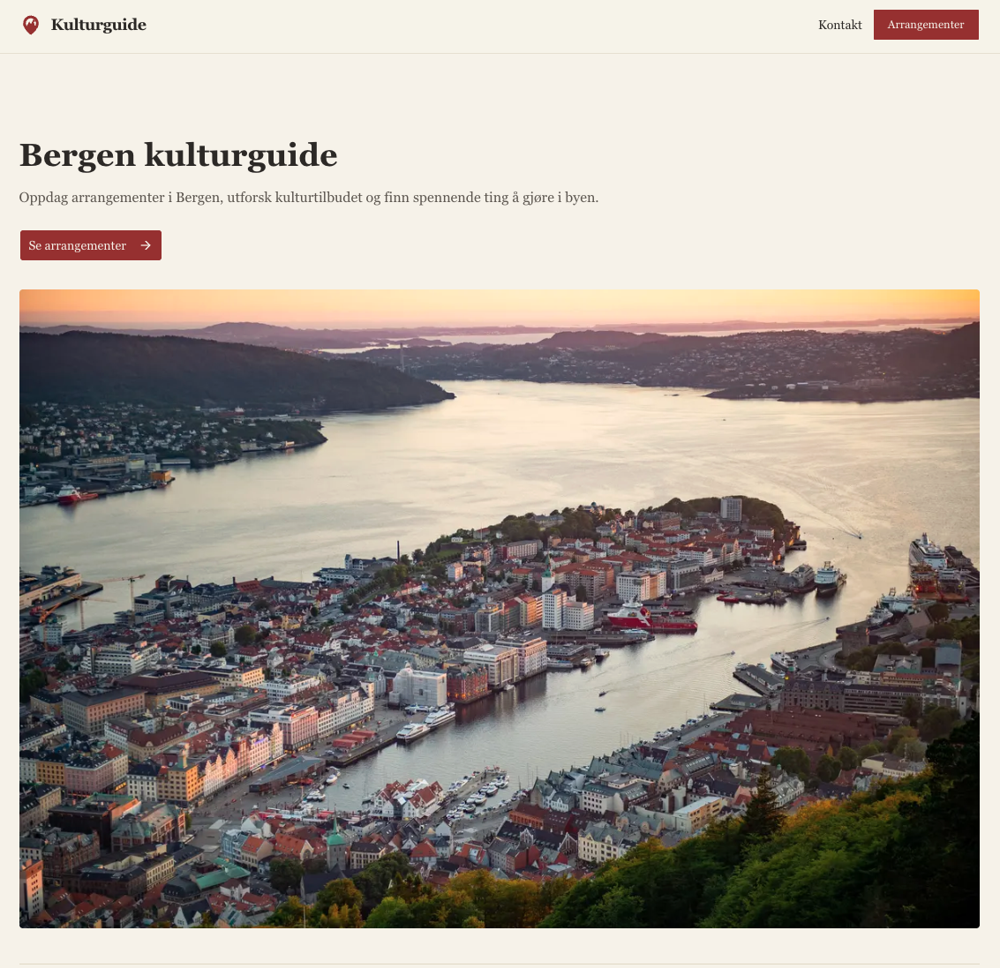

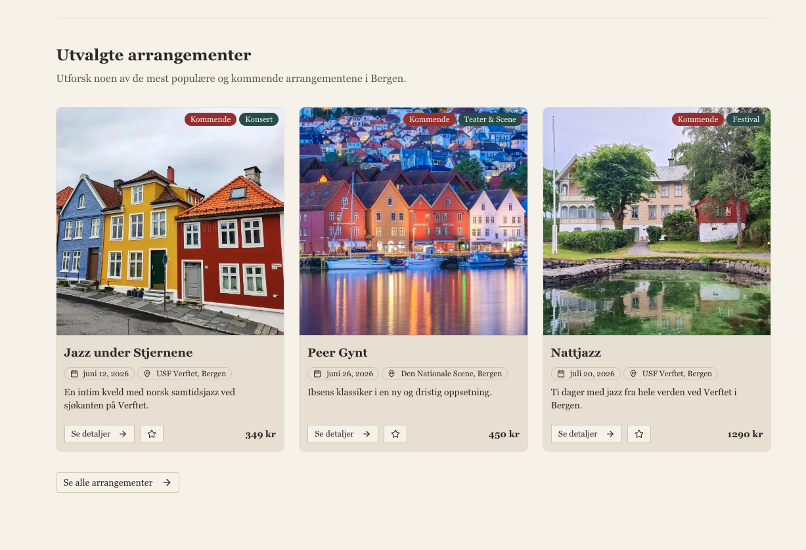

Nederst i seksjonen ligger en "Se alle arrangementer"-knapp som tar deg til den fullstendige oversikten.

## Arrangementer

På arrangementssiden finner du alle arrangementene i en oversikt med kort. Hvert kort viser bilde, kategori, tittel, dato, sted, en kort beskrivelse og pris. Arrangementer som ikke har startet enda er markert med et "Kommende"-merke, og gratis arrangementer vises med teksten "Gratis" i stedet for en pris.

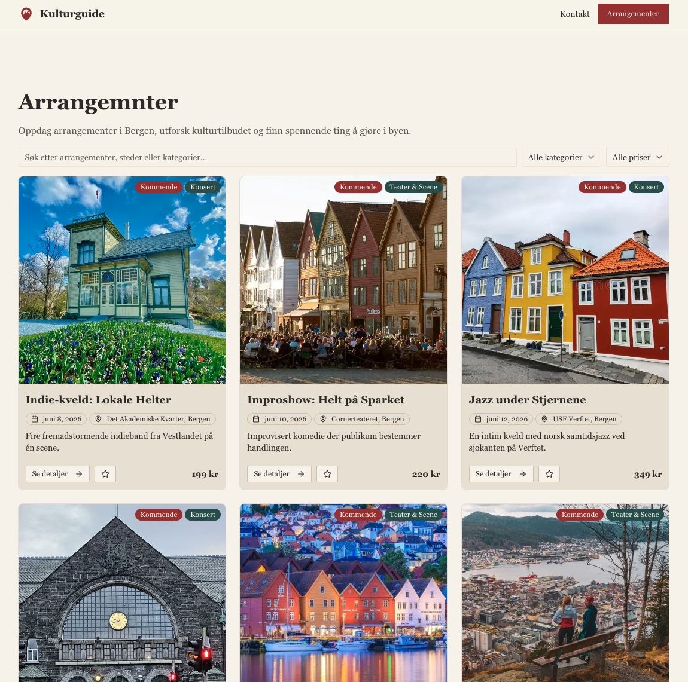

Øverst på siden har du tre verktøy for å finne fram:

- **Søkefelt:** Her kan du søke fritt etter arrangementer, steder eller kategorier. Søket er et intelligent (semantisk) søk – det forstår meningen i det du skriver og trenger ikke et eksakt treff på ordene. Resultatene oppdateres automatisk mens du skriver.
- **Kategorifilter:** En nedtrekksmeny der du kan velge en bestemt kategori (for eksempel "Konsert", "Teater & Scene" eller "Festival"), eller "Alle kategorier".
- **Prisfilter:** En nedtrekksmeny der du kan velge mellom "Alle priser", "Gratis" og "Betalt".

Filtrene og søket kan kombineres, og listen oppdateres umiddelbart.

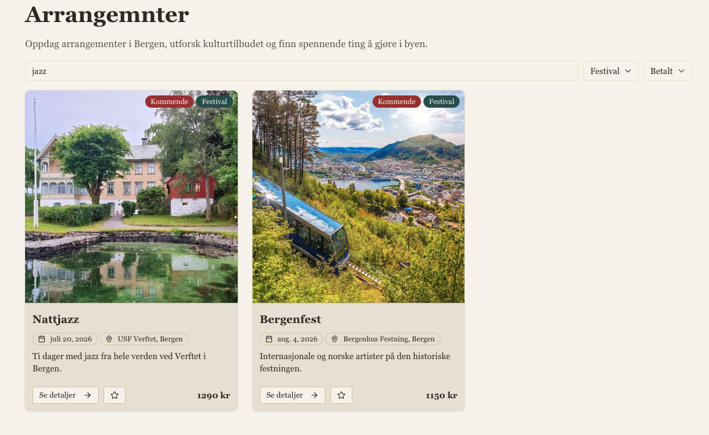

## Favoritter

På hvert arrangementskort finnes en **stjerneknapp**. Trykker du på den, markeres arrangementet som en favoritt og stjernen fylles inn. Trykker du igjen, fjernes favoritten. Favorittene lagres lokalt i din egen nettleser, slik at du ikke trenger en konto for å bruke funksjonen.

## Detaljside for et arrangement

Trykker du på et arrangementskort (eller "Se detaljer"-knappen), kommer du til detaljsiden for arrangementet. Her ser du en bildekarusell med eventuelle bilder, kategori, tittel og en oversiktlig informasjonsboks med dato, klokkeslett, sted og pris. Stedet er en lenke som åpner Google Maps, og det finnes også en egen "Vis på kart"-knapp.

Hvis arrangementet har flere bilder, kan du bla mellom dem med pilene, prikkene eller miniatyrbildene under hovedbildet.

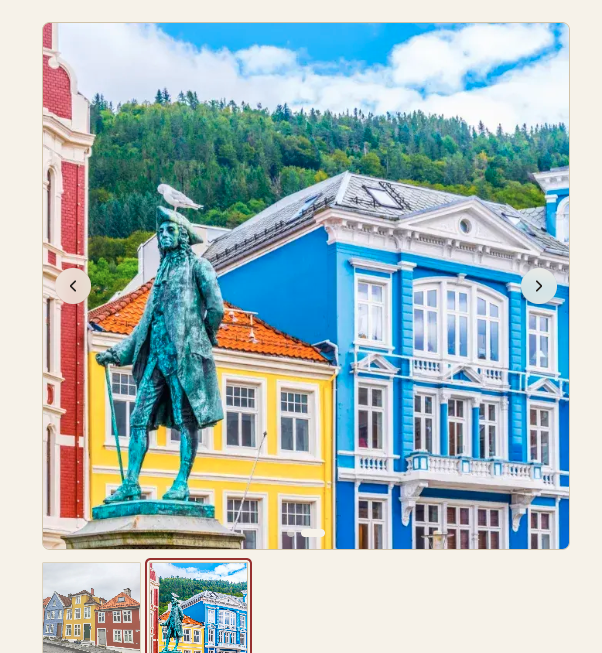

Øverst på siden ligger en "Tilbake til arrangementer"-lenke som tar deg tilbake til oversikten.

## Kontaktside

På kontaktsiden kan besøkende sende inn en henvendelse via et skjema med feltene **Navn**, **E-post** og **Melding**. Når du trykker "Send inn", valideres feltene: navn og melding kan ikke være tomme, og e-postadressen må være gyldig. Hvis noe mangler eller er feil, vises en tydelig feilmelding under det aktuelle feltet, samt en varslingsboble (toast).

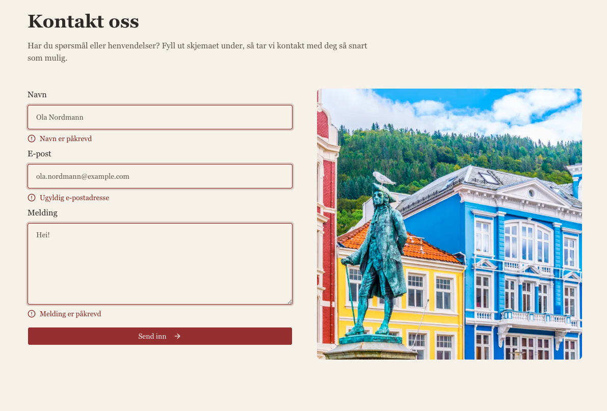

Når skjemaet er sendt inn riktig, tømmes feltene og det vises en bekreftelse ("Takk! Meldingen din er sendt."). Henvendelsen lagres i databasen og blir synlig for administratorer i admin-panelet.

## Lys og mørk modus

Nederst til høyre på siden (i footeren) ligger en knapp med et sol-/måneikon. Trykk på den for å bytte mellom lys og mørk modus. Valget gjelder hele nettsiden.

---

# Admin-panel

Admin-panelet er beskyttet bak innlogging og krever at brukeren har rollen `ADMIN`. Du finner det via "Admin"-lenken i footeren, eller ved å gå til `/admin`. Forsøker du å åpne en admin-side uten å være innlogget som administrator, blir du sendt til innloggingssiden.

## Innlogging

For å logge inn fyller du inn e-post og passord på innloggingssiden og trykker "Login".

> **Demo-innlogging:** Hvis databasen er fylt med eksempeldata (`bun run seed`), kan du logge inn med en av de forhåndsopprettede kontoene:
> - `admin@kulturguide.no` / `Admin123!` (administrator)
> - `editor@kulturguide.no` / `Redaktor99#` (administrator)
> - `user@kulturguide.no` / `Bruker123$` (vanlig bruker, ikke admin-tilgang)

## Registrering

På registreringssiden kan en ny bruker opprette en konto ved å fylle inn navn, e-post og passord (passordet må gjentas for bekreftelse). Passordet må være minst 8 tegn og inneholde minst ett tall og ett spesialtegn. Når kontoen er opprettet, får den som standard rollen som vanlig bruker og må gis admin-tilgang før den kan bruke admin-panelet.

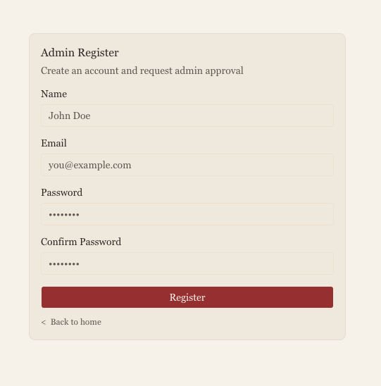

> **Merk:** Admin-tilgang gis ved å sette rollen `ADMIN` på brukeren i databasen. Det finnes foreløpig ikke et eget grensesnitt for å godkjenne nye brukere fra admin siden.

## Glemt passord

Har du glemt passordet ditt, trykker du på "Recover it here." på innloggingssiden. Da kommer du til en side der du skriver inn e-postadressen din for å motta en lenke for tilbakestilling av passord.

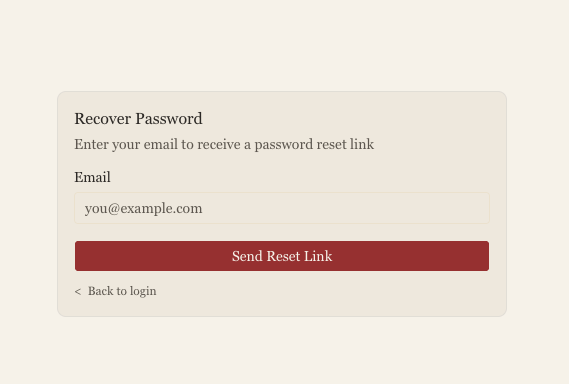

Når du følger lenken, kommer du til en side der du velger nytt passord. Siden viser en sjekkliste som bekrefter at passordet oppfyller kravene (minst 8 tegn, inneholder tall, inneholder spesialtegn), og at de to passordfeltene er like.

> **Merk:** Per nå sendes ikke e-poster ut – tilbakestillingslenken skrives i stedet ut i serverloggen

## Dashboard

Etter innlogging kommer du til admin-dashboardet. Til venstre ligger en sidemeny med navigasjon til **Events** (arrangementer), **Event Categories** (arrangementskategorier) og **Contact** (kontakthenvendelser). Nederst i sidemenyen ser du e-postadressen din, en knapp for å logge ut, og en knapp for å bytte mellom lys og mørk modus. Logoen øverst tar deg tilbake til den offentlige nettsiden.

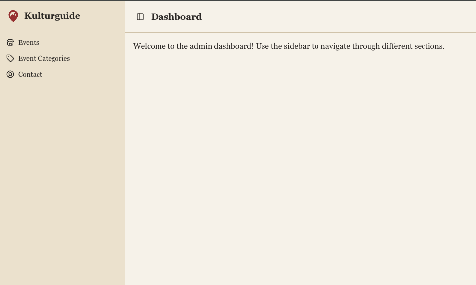

## Arrangementer (admin)

Under "Events" administrerer du alle arrangementene. Arrangementene vises som kort i et rutenett, og hvert kort har knapper for å redigere (blyantikon) og slette (søppelbøtteikon).

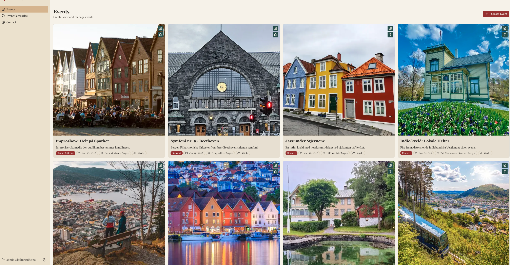

For å opprette et nytt arrangement trykker du på "Create Event"-knappen øverst. Da åpnes et skjema (dialog) der du fyller inn:

- **Category** – kategori for arrangementet (velges fra nedtrekksmeny)
- **Title** – tittel
- **Price (KR)** – pris i kroner (0 = gratis)
- **Date** – dato og klokkeslett
- **Location** – sted
- **Description** – beskrivelse
- **Featured** – en bryter for om arrangementet skal være "utvalgt" og vises på landingssiden
- **Images** – ett eller flere bilder. Bildene lastes opp når du velger dem, og alt-teksten settes automatisk til filnavnet. Maks filstørrelse er 5 MB per bilde.

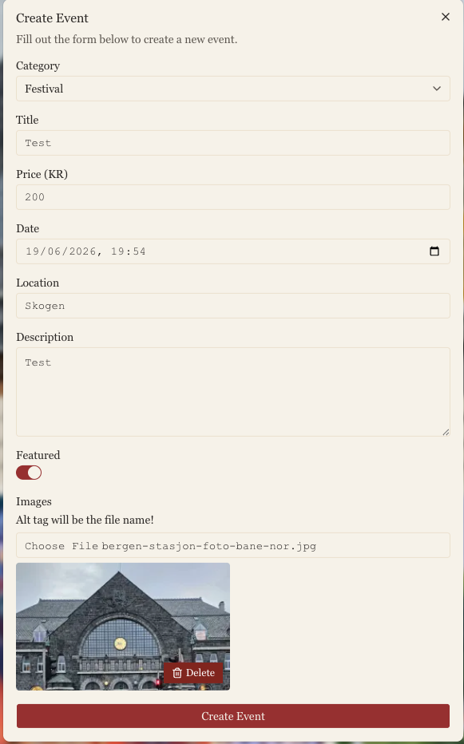

Når du redigerer et eksisterende arrangement, åpnes det samme skjemaet ferdig utfylt med arrangementets data, og knappen heter "Save Changes". Du kan fjerne et opplastet bilde ved å trykke på "Delete"-knappen på bildet. Endringene blir umiddelbart synlige på den offentlige nettsiden.

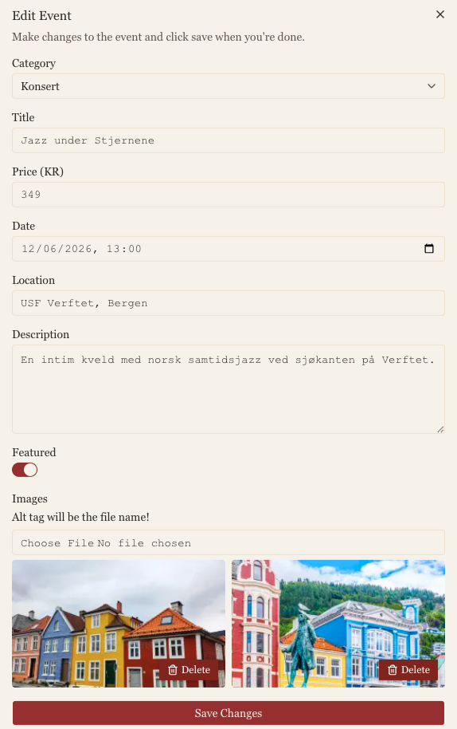

For å slette et arrangement trykker du på søppelbøtteikonet på arrangementskortet.

## Arrangementskategorier

Under "Event Categories" administrerer du kategoriene som arrangementer kan tilhøre. Kategoriene vises som kort, hver med en rediger- og en slett-knapp.

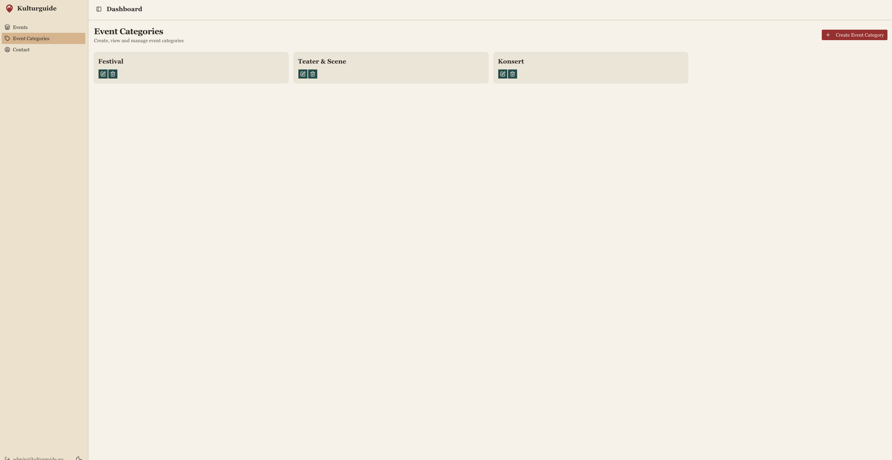

Trykk "Create Event Category" for å opprette en ny kategori. Da åpnes en dialog der du fyller inn navnet på kategorien. Den samme dialogen brukes til å endre navnet på en eksisterende kategori.

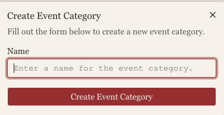

## Kontakthenvendelser

Under "Contact" ser du alle henvendelsene som er sendt inn via kontaktskjemaet på den offentlige nettsiden. Henvendelsene vises i en tabell med kolonnene **Name**, **Email**, **Message** og **Received** (mottatt dato), sortert med de nyeste øverst.

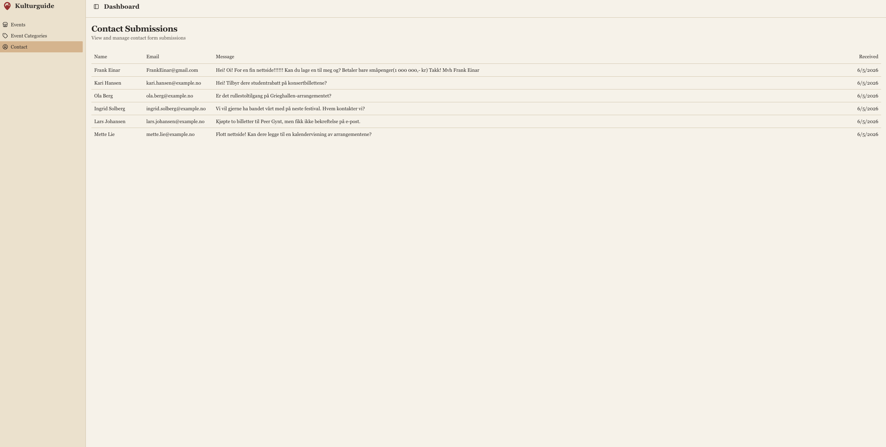

## Logg ut

For å logge ut trykker du på utloggingsikonet nederst i sidemenyen, ved siden av e-postadressen din. Du blir da sendt tilbake til innloggingssiden.

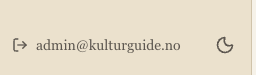
