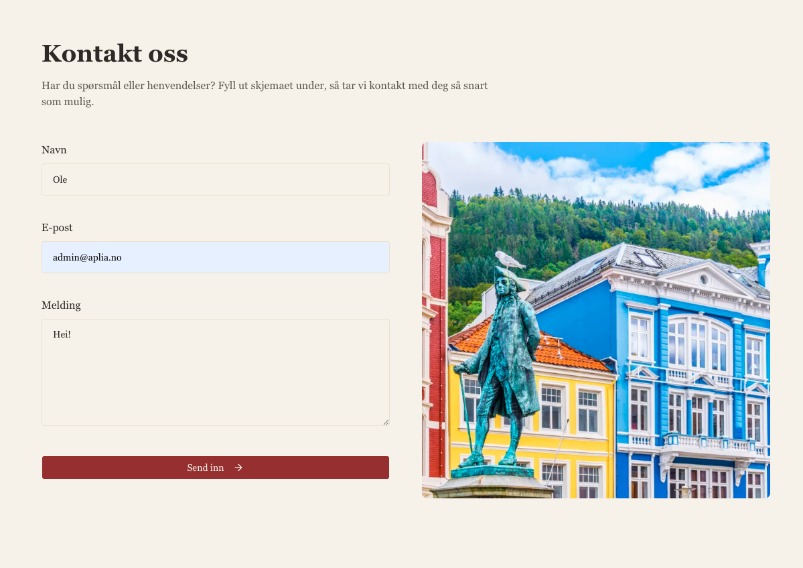
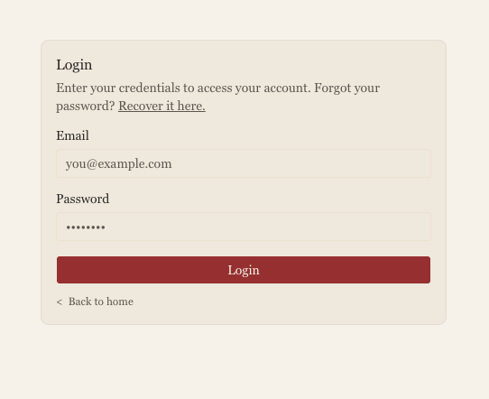
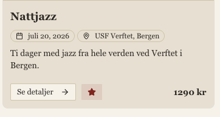
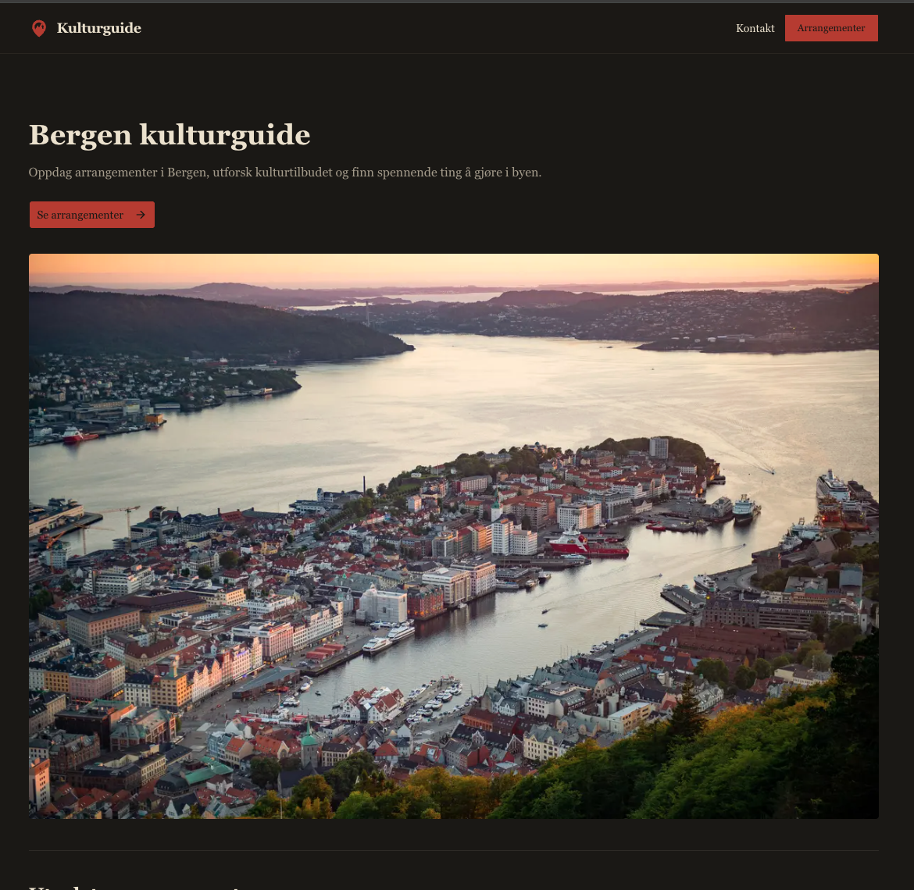
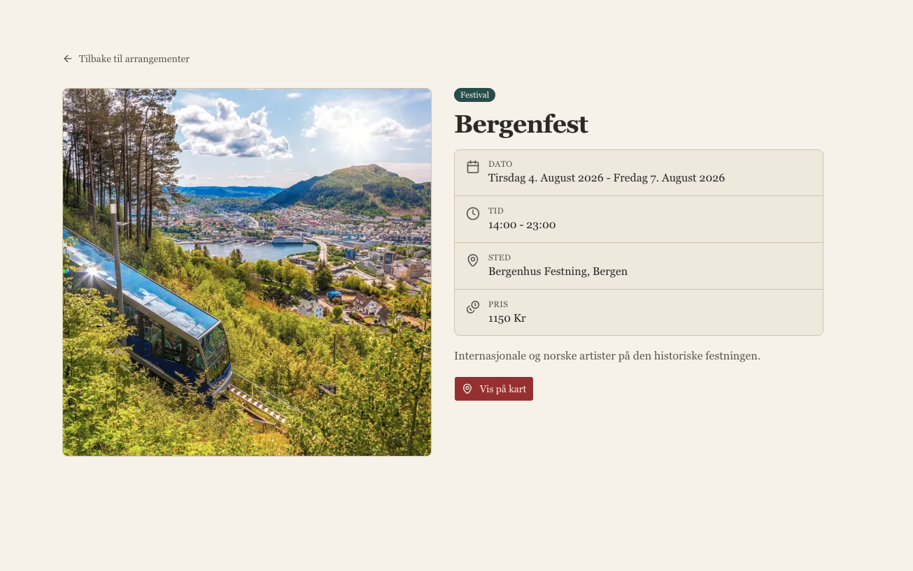

# Beskrivelse av relevante lovverk

## GDPR - Lov om behandling av personopplysninger (personopplysningsloven)

Dette lovverket omhandler behandling av personopplysninger. For Bergen Kulturguide gjelder denne loven hovedsakelig for to typer data: navn og e-postadresse til administratorbrukere som logger inn i admin-panelet, og navn, e-postadresse og melding som besøkende sender inn via kontaktskjemaet.

 Loven gir blant annet brukere rett til informasjon om hvordan personopplysningene deres behandles, til innsyn i hvilke opplysninger som er lagret om dem, til retting av opplysningene, og rett til å få personopplysningene slettet. I tillegg pålegger lovverket bedriften en del plikter, blant annet:

- Å fastsette et formål for behandlingen som må deles med brukerne på en klar og tydelig måte. For denne applikasjonen er formålet for administratorbrukere å begrense tilgangen til admin-funksjonene til kun godkjente personer, og navn og e-postadresse er nødvendig for at man skal kunne skille på hvem som har tilgang. For kontaktskjemaet er formålet å kunne svare på henvendelsen og ta kontakt tilbake.
- Å ha et gyldig behandlingsgrunnlag for informasjonen. For kontaktskjemaet vil dette typisk være samtykke (brukeren velger selv å sende inn skjemaet), mens det for administratorbrukere er nødvendig for å oppfylle en avtale/ansettelsesforhold.
- Å begrense mengden personopplysninger til kun det som er nødvendig for å oppnå formålet. Applikasjonen lagrer derfor bare navn og e-post for administratorer, og navn, e-post og melding for kontakthenvendelser. Det samles ikke inn mer enn dette.
- Å holde opplysningene korrekte og oppdaterte. Administratorer kan rette opplysninger i databasen, og en bruker kan be om å få sine opplysninger rettet.
- Å slette eller anonymisere opplysningene så snart de ikke lenger er nødvendige for formålet. For denne applikasjonen vil det si at en administratorbruker slettes når vedkommende ikke lenger skal ha tilgang, og at gamle kontakthenvendelser slettes når de er ferdigbehandlet.
- Å opprettholde integriteten og konfidensialiteten til opplysningene. For denne applikasjonen sikres dette ved rollebasert tilgangskontroll: kun innloggede brukere med rollen `ADMIN` kan se kontakthenvendelser og administrere innhold. Tilgangen håndheves både i en proxy/middleware (`src/proxy.ts`) som beskytter alle `/admin`-ruter, og i hver enkelt server-handling via `requireAdmin()`. Passord lagres aldri i klartekst, men hashes (scrypt) av Better Auth.

Et bevisst personvernvalg i applikasjonen er at **favoritter** lagres i brukerens egen nettleser (`localStorage`) og aldri sendes til serveren. En besøkende trenger derfor ikke en konto for å lagre favoritter, og det knyttes ingen personopplysninger til denne funksjonen. Dette er i tråd med prinsippet om dataminimering.

Mer informasjon finnes på https://www.datatilsynet.no/regelverk-og-verktoy/lover-og-regler/ og lovteksten finnes på: https://lovdata.no/dokument/NL/lov/2018-06-15-38

## Universell utforming

Dette lovverket går i hovedtrekk ut på at nettsiden/applikasjonen skal tilrettelegges slik at flest mulig kan bruke den. Dette involverer blant annet:

- At tekster på nettsiden skal ha et minimum kontrastforhold med bakgrunnen på 4,5:1. Applikasjonen bruker designsystemet shadcn/ui med tydelige farger og støtter både lys og mørk modus, slik at kontrasten holdes god i begge.

  
- At nettsiden skal kunne brukes med kun tastatur, og at elementer skal ha synlig fokus når man navigerer med tastatur og følge en logisk rekkefølge. Applikasjonen er bygget med semantiske og tilgjengelige komponenter (Radix UI via shadcn/ui), som gir fokushåndtering, tastaturnavigasjon og korrekte ARIA-roller på blant annet dialoger, menyer og knapper.
- At bilder skal ha alternativ tekst (alt-tekst) slik at skjermlesere kan beskrive dem. I denne applikasjonen lagres alt-tekst på hvert opplastet bilde (feltet `alt` på `File`-modellen), og den brukes når bildene vises i arrangementskort og i bildekarusellen. Navigasjonsknappene i karusellen har egne `aria-label`-er.

  
- At språket på siden er definert, slik at skjermlesere uttaler innholdet riktig. Rotdokumentet er satt til norsk (`<html lang="no">`).

Fullstendig liste over krav finnes på: https://www.uutilsynet.no/wcag-standarden/wcag-standarden/86
Lovverk: https://lovdata.no/dokument/SF/forskrift/2013-06-21-732